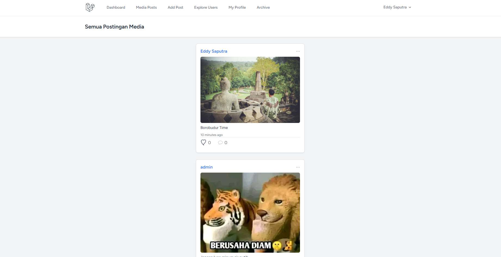
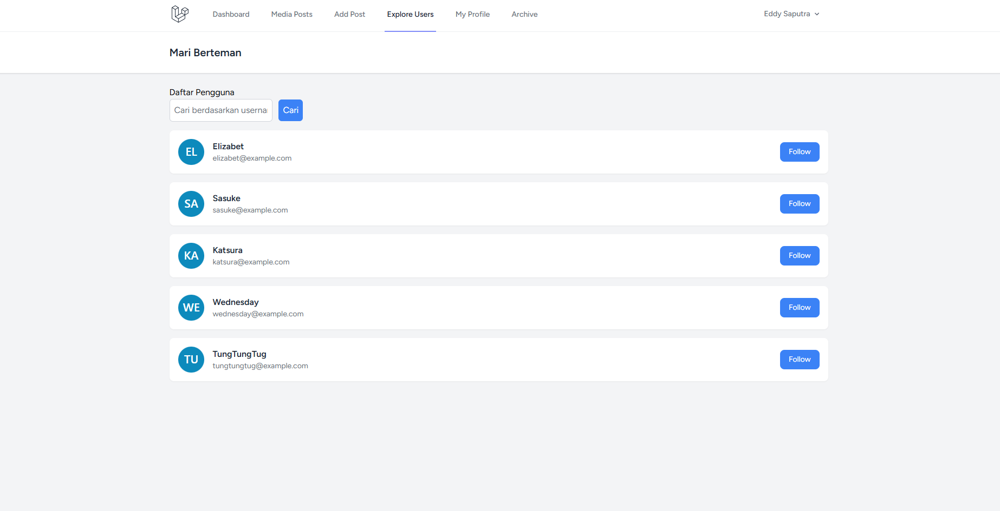
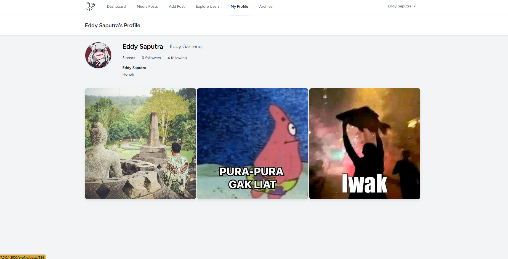

# Laravel Project Instagram Clone


> Proyek ini adalah aplikasi berbasis Laravel sebagai kerangka dasar untuk aplikasi Laravel.

## Tentang

Proyek ini adalah aplikasi berbasis Laravel yang dibangun menggunakan framework Laravel versi terbaru (12.x), dengan berbagai alat pengembangan dan paket terintegrasi untuk mempermudah proses pengembangan.

## Persyaratan

-   PHP >= 8.2
-   Composer
-   Node.js dan npm untuk kompilasi aset

## Instalasi

Ikuti petunjuk berikut untuk menyiapkan proyek ini di mesin lokal Anda.

### Clone Repository

```bash
git clone https://your-repository-url
cd your-project-folder
```

### Siapkan Environment

-   Salin file `.env.example` menjadi `.env`:

```bash
cp .env.example .env
```

-   Konfigurasi file `.env` dengan kredensial basis data dan lainnya.

### Instal Dependensi

-   Instal dependensi PHP:

```bash
composer install
```

-   Instal dependensi npm:

```bash
npm install
```

### Siapkan Aplikasi

-   Hasilkan kunci aplikasi:

```bash
php artisan key:generate
```

-   Siapkan basis data:

```bash
php artisan migrate --seed
```

-   (Opsional) Jika menggunakan SQLite, Anda dapat membuat file basis data secara manual:

```bash
touch database/database.sqlite
```

-   Hubungkan storage untuk file upload:

```bash
php artisan storage:link
```

### Menjalankan Aplikasi

Untuk menjalankan aplikasi dan mulai melayani, jalankan:

```bash
php artisan serve
```

### Menjalankan Lingkungan Pengembangan dengan Tugas Bersamaan

Untuk pengalaman pengembangan yang lebih lancar (server, queue, Vite), Anda dapat menjalankan:

```bash
npm run dev
```

## Paket yang Digunakan

-   **barryvdh/laravel-dompdf**: Untuk menghasilkan PDF.
-   **maatwebsite/excel**: Untuk menangani impor/ekspor Excel.
-   **spatie/laravel-permission**: Untuk mengelola peran dan izin pengguna.
-   **laravel/tinker**: Untuk pengembangan berbasis baris perintah interaktif.
-   **fakerphp/faker**: Untuk menghasilkan data palsu (digunakan di seeder).
-   **laravel/breeze**: Untuk scaffolding autentikasi.
-   **laravel/pail**: Untuk manajemen kontainer Docker.
-   **laravel/pint**: Untuk pemformatan kode.
-   **laravel/sail**: Untuk dukungan Docker bawaan Laravel.
-   **mockery/mockery**: Untuk mocking dalam pengujian.
-   **nunomaduro/collision**: Untuk penanganan kesalahan yang lebih baik selama pengembangan.
-   **phpunit/phpunit**: Untuk menjalankan pengujian.

## Menjalankan Pengujian

Untuk menjalankan pengujian dengan PHPUnit:

```bash
phpunit
```

## Seeder User

Seeder `UserSeeder` akan membuat beberapa akun pengguna beserta passwordnya, yang bisa digunakan untuk login. Berikut adalah contoh hasil yang akan ditampilkan setelah menjalankan seeder ini:

```
Name     : Katsura
Email    : katsura@example.com
Username : katsura
Role     : user
Password : Katsura123

Name     : Wednesday
Email    : wednesday@example.com
Username : wednesday
Role     : user
Password : Wednesday123

Name     : Admin User
Email    : admin@example.com
Username : adminuser
Role     : admin
Password : Admin123
```

Pastikan untuk mencatat password yang dihasilkan di atas, karena dapat digunakan untuk login ke dalam aplikasi. Anda dapat login menggunakan akun `user` atau `admin` sesuai dengan kebutuhan.

## Screenshot





## Lisensi

Proyek ini adalah perangkat lunak sumber terbuka yang dilisensikan di bawah [lisensi MIT](https://opensource.org/licenses/MIT).

## Kredit

-   [Laravel](https://laravel.com)
-   [Composer](https://getcomposer.org)
